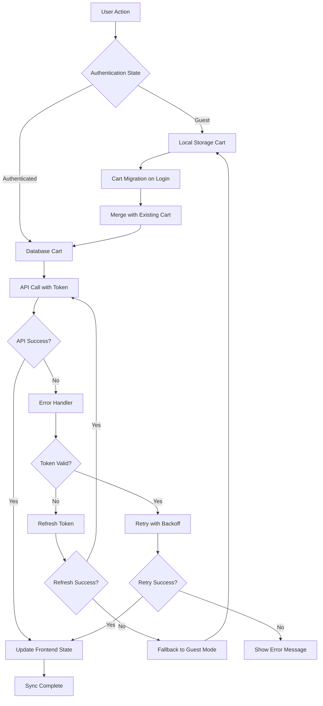

# Design Document - Cart Persistence Fix

## Overview

This design addresses the critical cart persistence issue where cart functionality works for guest users but fails after authentication. The root cause analysis indicates problems with cart synchronization, authentication token handling, and cart migration processes. The solution focuses on robust error handling, improved cart state management, and reliable authentication-aware cart operations.

**Key Design Rationale**: The existing cart system has the right architecture but lacks proper error handling and synchronization mechanisms. Rather than rebuilding, we'll enhance the current implementation with better state management, error recovery, and debugging capabilities.

### Problem Analysis
Based on code review, the main issues are:
1. **Authentication Token Issues**: Cart API calls may fail due to expired or missing tokens
2. **Cart Migration Failures**: Guest cart items may not properly transfer to authenticated cart
3. **State Synchronization**: Frontend cart state may become out of sync with backend
4. **Error Handling**: Insufficient error recovery mechanisms for failed cart operations
5. **Network Resilience**: No fallback behavior for network connectivity issues

## Architecture

### Enhanced Cart Flow Architecture



### Key Design Decisions

#### 1. Enhanced Authentication Token Management
**Design Decision**: Implement automatic token refresh and validation before cart operations.

**Rationale**: Many cart failures occur due to expired authentication tokens. The current implementation doesn't handle token refresh gracefully.

**Implementation**:
- Add token validation before each cart API call
- Implement automatic token refresh mechanism
- Fallback to guest mode if token refresh fails
- Queue cart operations during token refresh

#### 2. Robust Cart Migration Strategy
**Design Decision**: Implement multi-step cart migration with conflict resolution and rollback capabilities.

**Rationale**: Current cart migration may fail silently or create inconsistent state. We need reliable migration with proper error handling.

**Implementation**:
- Pre-migration validation of guest cart items
- Atomic migration operations with rollback capability
- Conflict resolution for duplicate items (merge quantities)
- Post-migration verification and cleanup

#### 3. Resilient State Management
**Design Decision**: Implement optimistic updates with server reconciliation and error recovery.

**Rationale**: Cart operations should feel instant while maintaining data consistency with the server.

**Implementation**:
- Optimistic UI updates for immediate feedback
- Server reconciliation to ensure consistency
- Automatic retry with exponential backoff for failed operations
- State rollback on persistent failures

#### 4. Comprehensive Error Handling
**Design Decision**: Implement layered error handling with user-friendly messages and developer debugging.

**Rationale**: Current error handling is insufficient for diagnosing and recovering from cart issues.

**Implementation**:
- Categorized error types with specific handling strategies
- User-friendly error messages with actionable guidance
- Detailed logging for debugging and monitoring
- Graceful degradation for non-critical failures

## Components and Interfaces

### Enhanced Cart Context

#### Updated CartContext Interface
```javascript
// Enhanced cart context with better error handling and state management
const CartContext = {
  // State
  items: Array,
  totalAmount: Number,
  loading: Boolean,
  error: Object | null,
  isOnline: Boolean,
  lastSyncTime: Date,
  
  // Core Operations
  addToCart: (productId, size, quantity, price) => Promise,
  updateCartItem: (productId, size, quantity) => Promise,
  removeFromCart: (productId, size) => Promise,
  clearCart: () => Promise,
  
  // Enhanced Operations
  syncWithServer: () => Promise,
  retryFailedOperations: () => Promise,
  validateCartItems: () => Promise,
  
  // Utility Functions
  getCartTotal: () => Number,
  getCartItemCount: () => Number,
  isItemInCart: (productId, size) => Boolean,
  
  // Error Handling
  clearError: () => void,
  getErrorDetails: () => Object
};
```

#### Enhanced Error Handling Structure
```javascript
const CartError = {
  type: 'NETWORK_ERROR' | 'AUTH_ERROR' | 'VALIDATION_ERROR' | 'SERVER_ERROR',
  message: String, // User-friendly message
  code: String, // Error code for debugging
  details: Object, // Additional error details
  timestamp: Date,
  retryable: Boolean, // Whether operation can be retried
  action: String // Suggested user action
};
```

### Enhanced API Service Layer

#### Token Management Service
```javascript
const TokenManager = {
  validateToken: () => Boolean,
  refreshToken: () => Promise<String>,
  isTokenExpired: () => Boolean,
  getValidToken: () => Promise<String>,
  handleTokenError: (error) => Promise<String>
};
```

#### Enhanced Cart API with Retry Logic
```javascript
const EnhancedCartAPI = {
  // Core operations with automatic retry
  addToCart: (item, options = {}) => Promise,
  updateCartItem: (item, options = {}) => Promise,
  removeFromCart: (productId, size, options = {}) => Promise,
  
  // Batch operations for efficiency
  batchUpdateCart: (operations) => Promise,
  migrateGuestCart: (guestItems, options = {}) => Promise,
  
  // Validation and sync
  validateCart: () => Promise,
  syncCart: () => Promise,
  
  // Configuration
  setRetryConfig: (config) => void,
  setOfflineMode: (enabled) => void
};
```

### Backend Enhancements

#### Enhanced Cart Controller Methods
```javascript
const CartController = {
  // Existing methods with enhanced error handling
  getCart: (req, res) => Promise,
  addToCart: (req, res) => Promise,
  updateCartItem: (req, res) => Promise,
  removeFromCart: (req, res) => Promise,
  
  // New methods for better cart management
  batchUpdateCart: (req, res) => Promise,
  validateCartItems: (req, res) => Promise,
  getCartHealth: (req, res) => Promise,
  
  // Enhanced migration with conflict resolution
  mergeGuestCart: (req, res) => Promise,
  resolveCartConflicts: (req, res) => Promise
};
```

## Data Models

### Enhanced Cart Item Validation
```javascript
const CartItemSchema = {
  productId: {
    type: ObjectId,
    ref: 'Product',
    required: true,
    validate: {
      validator: async function(productId) {
        const product = await Product.findById(productId);
        return product && product.isActive;
      },
      message: 'Product not found or inactive'
    }
  },
  size: {
    type: String,
    required: true,
    validate: {
      validator: async function(size) {
        const product = await Product.findById(this.productId);
        return product && product.sizes.some(s => s.size === size && s.stock > 0);
      },
      message: 'Size not available or out of stock'
    }
  },
  quantity: {
    type: Number,
    required: true,
    min: [1, 'Quantity must be at least 1'],
    max: [10, 'Quantity cannot exceed 10'],
    validate: {
      validator: async function(quantity) {
        const product = await Product.findById(this.productId);
        const sizeInfo = product?.sizes.find(s => s.size === this.size);
        return sizeInfo && sizeInfo.stock >= quantity;
      },
      message: 'Insufficient stock for requested quantity'
    }
  },
  price: {
    type: Number,
    required: true,
    validate: {
      validator: async function(price) {
        const product = await Product.findById(this.productId);
        return product && Math.abs(product.price - price) < 0.01;
      },
      message: 'Price mismatch with current product price'
    }
  },
  addedAt: {
    type: Date,
    default: Date.now
  }
};
```

### Cart Operation Log Schema
```javascript
const CartOperationLogSchema = {
  userId: { type: ObjectId, ref: 'User', required: true },
  operation: {
    type: String,
    enum: ['ADD', 'UPDATE', 'REMOVE', 'CLEAR', 'MIGRATE'],
    required: true
  },
  productId: { type: ObjectId, ref: 'Product' },
  size: String,
  quantity: Number,
  success: { type: Boolean, required: true },
  error: {
    type: String,
    code: String,
    details: Object
  },
  timestamp: { type: Date, default: Date.now },
  sessionId: String,
  userAgent: String
};
```

## Error Handling

### Error Categories and Handling Strategies

#### 1. Authentication Errors
```javascript
const AuthErrorHandler = {
  TOKEN_EXPIRED: {
    strategy: 'REFRESH_TOKEN',
    userMessage: 'Session expired. Refreshing...',
    retryable: true,
    maxRetries: 1
  },
  TOKEN_INVALID: {
    strategy: 'REDIRECT_LOGIN',
    userMessage: 'Please log in again to continue',
    retryable: false
  },
  REFRESH_FAILED: {
    strategy: 'FALLBACK_GUEST',
    userMessage: 'Continuing as guest. Please log in to save your cart.',
    retryable: false
  }
};
```

#### 2. Network Errors
```javascript
const NetworkErrorHandler = {
  CONNECTION_TIMEOUT: {
    strategy: 'RETRY_WITH_BACKOFF',
    userMessage: 'Connection slow. Retrying...',
    retryable: true,
    maxRetries: 3,
    backoffMultiplier: 2
  },
  NETWORK_UNAVAILABLE: {
    strategy: 'OFFLINE_MODE',
    userMessage: 'Working offline. Changes will sync when connection returns.',
    retryable: true
  },
  SERVER_UNAVAILABLE: {
    strategy: 'QUEUE_OPERATIONS',
    userMessage: 'Server temporarily unavailable. Your changes are saved locally.',
    retryable: true
  }
};
```

#### 3. Validation Errors
```javascript
const ValidationErrorHandler = {
  PRODUCT_UNAVAILABLE: {
    strategy: 'REMOVE_ITEM',
    userMessage: 'This item is no longer available and has been removed from your cart.',
    retryable: false
  },
  INSUFFICIENT_STOCK: {
    strategy: 'ADJUST_QUANTITY',
    userMessage: 'Only {availableStock} items available. Quantity adjusted.',
    retryable: false
  },
  PRICE_CHANGED: {
    strategy: 'UPDATE_PRICE',
    userMessage: 'Price updated to current amount: ₹{newPrice}',
    retryable: false
  }
};
```

### Error Recovery Mechanisms

#### Automatic Retry Logic
```javascript
const RetryConfig = {
  maxRetries: 3,
  baseDelay: 1000, // 1 second
  maxDelay: 10000, // 10 seconds
  backoffMultiplier: 2,
  retryableErrors: [
    'NETWORK_ERROR',
    'TIMEOUT_ERROR',
    'SERVER_ERROR_5XX',
    'TOKEN_EXPIRED'
  ]
};
```

#### Operation Queue for Offline Support
```javascript
const OperationQueue = {
  queueOperation: (operation) => void,
  processQueue: () => Promise,
  clearQueue: () => void,
  getQueueStatus: () => Object
};
```

## Testing Strategy

### Unit Tests
- Cart context state management and reducers
- API service retry logic and error handling
- Token management and refresh mechanisms
- Cart migration and conflict resolution logic
- Error categorization and handling strategies

### Integration Tests
- Complete cart workflows (guest to authenticated)
- Cart migration scenarios with various edge cases
- Authentication token refresh during cart operations
- Network failure and recovery scenarios
- Cart synchronization between frontend and backend

### End-to-End Tests
- Full user journey from guest cart to authenticated purchase
- Cart persistence across browser sessions and devices
- Error recovery and user experience during failures
- Performance testing for cart operations under load
- Cross-browser compatibility for cart functionality

### Error Simulation Tests
- Network connectivity issues during cart operations
- Authentication token expiration scenarios
- Server unavailability and recovery
- Database connection failures
- Invalid product data and stock changes

## Performance Optimization

### Frontend Optimizations
- Debounced cart operations to reduce API calls
- Optimistic updates for immediate user feedback
- Efficient cart state management with minimal re-renders
- Lazy loading of cart-related components
- Caching of frequently accessed cart data

### Backend Optimizations
- Batch cart operations to reduce database queries
- Efficient cart validation with minimal product lookups
- Connection pooling for database operations
- Caching of product availability data
- Optimized cart migration algorithms

### Network Optimizations
- Request deduplication for simultaneous cart operations
- Compression of cart data in API responses
- Efficient polling for cart synchronization
- Minimal payload sizes for cart updates
- CDN caching for static cart-related assets

## Security Considerations

### Authentication Security
- Secure token storage and transmission
- Token rotation and expiration handling
- Protection against token theft and replay attacks
- Secure cart migration without data leakage
- Rate limiting for cart operations

### Data Protection
- Validation of all cart operations against user permissions
- Protection against cart manipulation attacks
- Secure handling of guest cart data
- Encryption of sensitive cart information
- Audit logging for cart operations

### Privacy Considerations
- Minimal data collection for guest users
- Secure cleanup of guest cart data after migration
- Protection of user shopping behavior data
- Compliance with data retention policies
- Transparent handling of cart data across authentication states