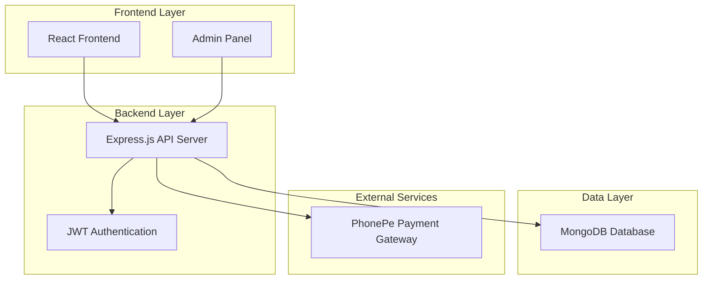

# Design Document - MERN Stack Men's Clothing Shop

## Overview

The men's clothing e-commerce platform will be built using the MERN stack with a modern, scalable architecture. The system consists of a React frontend, Node.js/Express.js backend API, and MongoDB database, with PhonePe integration for payments in Indian Rupees.

**Key Design Rationale**: The MERN stack was chosen to provide a unified JavaScript development experience while MongoDB's document-based structure aligns well with the flexible nature of e-commerce product catalogs and user data management.

### Architecture Principles
- RESTful API design for clear separation between frontend and backend
- Component-based React architecture for reusable UI elements
- MongoDB document-based data modeling for flexible schema design
- JWT-based authentication for secure user sessions
- Responsive design for mobile and desktop compatibility
- Guest browsing capability without mandatory registration (Requirement 1)
- Persistent cart functionality for authenticated users (Requirement 3)

## Architecture

### High-Level Architecture



### Technology Stack
- **Frontend**: React 18, React Router, Axios, Material-UI/Tailwind CSS
- **Backend**: Node.js, Express.js, Mongoose ODM
- **Database**: MongoDB with collections for users, products, orders, cart
- **Authentication**: JWT tokens with bcrypt for password hashing
- **Payment**: PhonePe SDK integration
- **File Storage**: Local storage or cloud storage for product images

## Key Design Decisions

### Guest vs Authenticated User Experience
**Design Decision**: Implement a dual-mode system that allows full product browsing for guests while providing enhanced features for authenticated users.

**Rationale**: Requirement 1 specifies that visitors should be able to browse products without registration, which reduces friction and improves user acquisition. However, Requirements 2 and 3 require user accounts for personalized experiences and persistent carts.

**Implementation**:
- Guest users can browse all products, view details, and search/filter (Requirement 1)
- Cart functionality available to guests using local storage for temporary storage
- Authentication required for cart persistence across sessions (Requirement 3)
- Seamless transition from guest to authenticated user with cart migration

### Cart Persistence Strategy
**Design Decision**: Implement MongoDB-based cart persistence for authenticated users with local storage fallback for guests.

**Rationale**: Requirement 3 specifically states that cart contents should be preserved across browser sessions for logged-in users, ensuring a seamless shopping experience.

**Implementation**:
- Authenticated users: Cart stored in MongoDB and synced across devices
- Guest users: Cart stored in browser local storage (temporary)
- Cart migration when guest users register or log in

### PhonePe Integration Architecture
**Design Decision**: Server-side PhonePe integration with secure callback handling for INR transactions.

**Rationale**: Requirement 4 mandates PhonePe integration for secure payment processing in Indian Rupees with proper order confirmation.

**Implementation**:
- Backend handles all PhonePe API communications
- Frontend initiates payment requests through secure API endpoints
- Webhook handling for payment status updates
- Order confirmation generation upon successful payment

## Components and Interfaces

### Frontend Components

#### Core Components
1. **App Component**: Main application wrapper with routing and guest/authenticated user state management
2. **Header/Navigation**: Logo, search bar (Requirement 1), cart icon, user menu with login/register options
3. **ProductGrid**: Display products in responsive grid layout with category filtering (Requirement 1)
4. **ProductCard**: Individual product display with image, name, price, and availability status (Requirement 1)
5. **ProductDetail**: Detailed product view with images, description, sizes, price, and add-to-cart functionality (Requirement 1, 3)
6. **CategoryFilter**: Component for filtering products by clothing type (Requirement 1)
7. **SearchBar**: Product search functionality component (Requirement 1)
8. **ShoppingCart**: Cart sidebar/page with item management, quantity updates, and removal (Requirement 3)
9. **Checkout**: Multi-step checkout process with PhonePe integration (Requirement 4)
10. **UserDashboard**: User profile management and order history (Requirement 2)
11. **AuthForms**: Login and registration forms with JWT authentication (Requirement 2)

#### Page Components
- **HomePage**: Featured products and categories accessible to all visitors (Requirement 1)
- **ProductsPage**: Product listing with category filters and search functionality (Requirement 1)
- **CartPage**: Full cart view with quantity management and item removal (Requirement 3)
- **CheckoutPage**: Payment processing with PhonePe integration and shipping/billing information collection (Requirement 4)
- **ProfilePage**: User account management with profile updates and address management (Requirement 2)
- **OrderHistoryPage**: Past orders and tracking for authenticated customers (Requirement 2)

### Backend API Endpoints

#### Authentication Routes
```
POST /api/auth/register - User registration
POST /api/auth/login - User login
POST /api/auth/logout - User logout
GET /api/auth/profile - Get user profile
PUT /api/auth/profile - Update user profile
```

#### Product Routes
```
GET /api/products - Get all products with availability status (Requirement 1)
GET /api/products/:id - Get single product with detailed information (Requirement 1)
GET /api/products/search?q=query - Search products by name/description (Requirement 1)
GET /api/products/category/:category - Get products by clothing type (Requirement 1)
```

#### Cart Routes
```
GET /api/cart - Get user's persistent cart (Requirement 3)
POST /api/cart/add - Add item with size selection to cart (Requirement 3)
PUT /api/cart/update - Update cart item quantity (Requirement 3)
DELETE /api/cart/remove/:itemId - Remove item from cart (Requirement 3)
DELETE /api/cart/clear - Clear entire cart
GET /api/cart/total - Get real-time cart total in INR with taxes and shipping (Requirement 3)
```

#### Order Routes
```
POST /api/orders - Create new order
GET /api/orders - Get user's orders
GET /api/orders/:id - Get specific order details
PUT /api/orders/:id/status - Update order status (admin)
```

#### Payment Routes
```
POST /api/payment/initiate - Initiate PhonePe payment in INR (Requirement 4)
POST /api/payment/callback - Handle PhonePe callback and update order status (Requirement 4)
GET /api/payment/status/:orderId - Check payment status
POST /api/orders/calculate-total - Calculate final order total with taxes and shipping in INR (Requirement 4)
```

## Data Models

### User Schema
```javascript
{
  _id: ObjectId,
  email: String (unique, required),
  password: String (hashed, required),
  firstName: String (required),
  lastName: String (required),
  phone: String,
  addresses: [{
    type: String, // 'shipping' or 'billing'
    street: String,
    city: String,
    state: String,
    pincode: String,
    isDefault: Boolean
  }],
  role: String (default: 'customer'), // 'customer' or 'admin'
  createdAt: Date,
  updatedAt: Date
}
```

### Product Schema
```javascript
{
  _id: ObjectId,
  name: String (required),
  description: String (required), // Detailed product information (Requirement 1)
  category: String (required), // 'shirts', 'pants', 'jackets', etc. for filtering (Requirement 1)
  brand: String,
  price: Number (required), // in INR (Requirement 1, 4)
  images: [String], // image URLs for product display (Requirement 1)
  sizes: [{
    size: String, // 'S', 'M', 'L', 'XL', 'XXL'
    stock: Number // For availability status display (Requirement 1)
  }],
  colors: [String],
  tags: [String], // For search functionality (Requirement 1)
  isActive: Boolean (default: true),
  availability: String, // 'in-stock', 'out-of-stock', 'limited' (Requirement 1)
  createdAt: Date,
  updatedAt: Date
}
```

### Cart Schema
```javascript
{
  _id: ObjectId,
  userId: ObjectId (ref: 'User'), // For persistent cart across sessions (Requirement 3)
  items: [{
    productId: ObjectId (ref: 'Product'),
    size: String (required), // Size selection requirement (Requirement 3)
    color: String,
    quantity: Number (required), // Modifiable quantities (Requirement 3)
    price: Number // price at time of adding to cart in INR
  }],
  subtotal: Number, // in INR
  tax: Number, // calculated tax in INR
  shipping: Number, // shipping cost in INR
  totalAmount: Number, // real-time total in INR (Requirement 3)
  createdAt: Date,
  updatedAt: Date
}
```

### Order Schema
```javascript
{
  _id: ObjectId,
  userId: ObjectId (ref: 'User'),
  orderNumber: String (unique), // Tracking number generation (Requirement 4)
  items: [{
    productId: ObjectId (ref: 'Product'),
    name: String,
    size: String,
    color: String,
    quantity: Number,
    price: Number // in INR
  }],
  shippingAddress: {
    street: String (required), // Collected during checkout (Requirement 4)
    city: String (required),
    state: String (required),
    pincode: String (required)
  },
  billingAddress: {
    street: String (required), // Collected during checkout (Requirement 4)
    city: String (required),
    state: String (required),
    pincode: String (required)
  },
  paymentDetails: {
    method: String, // 'phonepay' (Requirement 4)
    transactionId: String, // PhonePe transaction ID
    amount: Number, // in INR (Requirement 4)
    status: String // 'pending', 'completed', 'failed'
  },
  orderStatus: String, // 'pending', 'confirmed', 'shipped', 'delivered', 'cancelled'
  subtotal: Number, // in INR
  tax: Number, // calculated tax in INR (Requirement 4)
  shipping: Number, // shipping cost in INR (Requirement 4)
  total: Number, // final total in INR (Requirement 4)
  createdAt: Date,
  updatedAt: Date
}
```

## Error Handling

### Frontend Error Handling
- Global error boundary component to catch React errors
- Axios interceptors for API error handling
- User-friendly error messages and notifications
- Loading states and error states for all async operations
- Form validation with real-time feedback

### Backend Error Handling
- Global error middleware for Express.js
- Custom error classes for different error types
- Proper HTTP status codes for different scenarios
- Error logging for debugging and monitoring
- Input validation using middleware (e.g., express-validator)

### Error Response Format
```javascript
{
  success: false,
  error: {
    message: "User-friendly error message",
    code: "ERROR_CODE",
    details: {} // Additional error details if needed
  }
}
```

## Testing Strategy

### Frontend Testing
- Unit tests for React components using Jest and React Testing Library
- Integration tests for user flows (login, add to cart, checkout)
- End-to-end tests using Cypress for critical user journeys
- Component snapshot testing for UI consistency

### Backend Testing
- Unit tests for API endpoints using Jest and Supertest
- Database integration tests with test database
- Authentication and authorization testing
- Payment integration testing with PhonePe sandbox
- API contract testing to ensure frontend-backend compatibility

### Test Coverage Goals
- Minimum 80% code coverage for critical business logic
- 100% coverage for payment and authentication flows
- All API endpoints should have corresponding tests
- Critical user journeys should be covered by E2E tests

## Security Considerations

### Authentication & Authorization
- JWT tokens with appropriate expiration times for secure user sessions (Requirement 2)
- Password hashing using bcrypt with salt rounds for user registration (Requirement 2)
- Role-based access control for admin features
- Secure session management with token refresh capabilities
- Guest browsing without compromising security (Requirement 1)

### Data Protection
- Input validation and sanitization for all user inputs
- NoSQL injection prevention using Mongoose ODM
- XSS protection with proper data encoding
- CORS configuration for API security
- Rate limiting for API endpoints to prevent abuse
- Secure cart data persistence for authenticated users (Requirement 3)

### Payment Security
- PCI DSS compliance considerations for PhonePe payment handling (Requirement 4)
- Secure PhonePe integration following their security guidelines for INR transactions (Requirement 4)
- No storage of sensitive payment information on our servers
- HTTPS enforcement for all payment-related operations (Requirement 4)
- Secure order confirmation and tracking number generation (Requirement 4)

## Performance Optimization

### Frontend Optimization
- Code splitting and lazy loading for React components
- Image optimization and lazy loading
- Caching strategies for product data
- Minification and bundling optimization
- Progressive Web App (PWA) features for mobile experience

### Backend Optimization
- Database indexing for frequently queried fields
- API response caching for product catalog
- Pagination for large data sets
- Connection pooling for MongoDB
- API rate limiting and throttling

### Database Optimization
- Proper indexing strategy for MongoDB collections
- Aggregation pipelines for complex queries
- Data denormalization where appropriate
- Regular database maintenance and monitoring